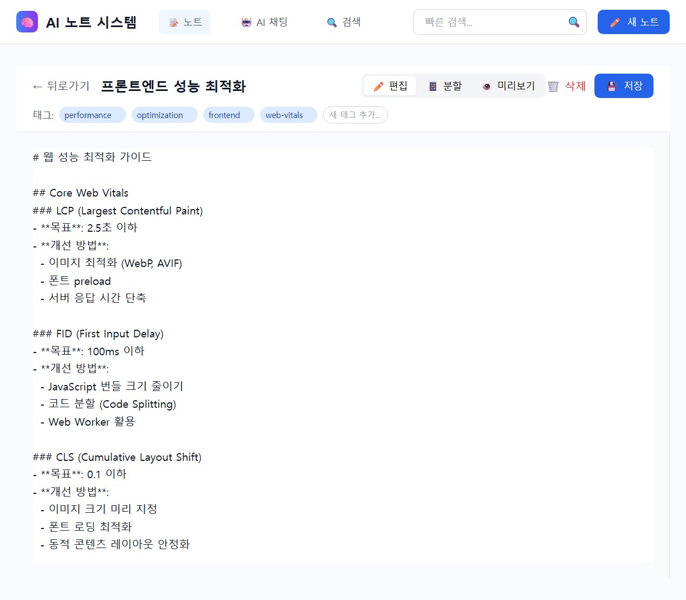
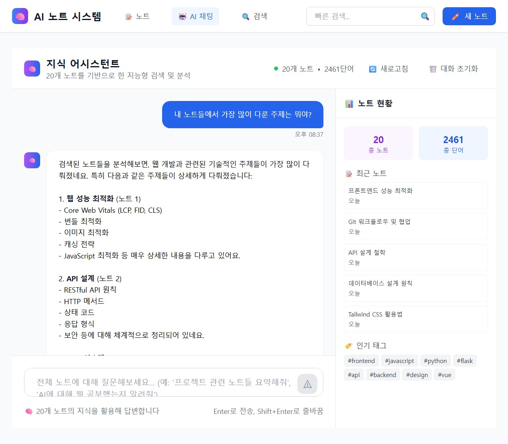

# 🧠 AI 학습노트 시스템

> **LangChain + Claude + RAG 기반 지능형 노트 관리 플랫폼**

---

## 🎯 프로젝트 개요

* **핵심 기술:** LangChain + Claude 3.5 Sonnet + RAG + Vue.js
* **목적:** LangChain 핵심 컴포넌트를 활용한 혁신적인 학습 도구 구현
* **컨셉:** AI와 함께하는 차세대 지능형 학습 노트 시스템

---

## ✅ 주요 구현 기능

### 🔍 AI 기반 노트 검색 및 응답

* **FAISS 기반 벡터 검색**: 의미 기반 유사 노트 자동 탐색
* **Conversational Retrieval Chain**: 노트 기반 Q\&A 및 문맥 유지
* **실시간 임베딩**: Sentence Transformers로 노트 내용 자동 벡터화

### 🧠 지능형 노트 관리

* **마크다운 기반 편집기**: 실시간 자동 저장 기능 탑재
* **스마트 태그 및 노트 연결**: `#태그`, `[[노트제목]]` 문법 지원
* **노트 CRUD 기능**: 작성, 수정, 삭제, 목록 필터링 완비

### 🖥 Vue.js 기반 프론트엔드

* **SPA 구성**: Vue Router + Pinia 상태 관리
* **AI 어시스턴트 연동**: AI 채팅을 통한 인터랙션 제공
* **완전 한글화**: 모든 화면 및 기능 로컬라이징 완료

---

## 📸 결과 스크린샷

* 초기 화면 / 노트 리스트

* 노트 편집 화면

* AI 응답 인터페이스

---

## ⚙ 기술 스택

### Backend (Flask)

```
Flask 3.1.1
├── LangChain 0.3.26
├── Claude API (Anthropic)
├── Sentence Transformers
├── FAISS
├── SQLite
└── Flask-CORS
```

### Frontend (Vue.js)

```
Vue.js 3.5
├── Pinia
├── Vue Router 4
├── Tailwind CSS
├── Chart.js
└── Vite 5 + Axios
```

---

## 🏗 시스템 아키텍처

```
ai-note-system/
├── backend/
│   ├── app/ (모듈화 구조)
│   ├── chains/ (LangChain AI 체인)
│   ├── models/ (DB 모델)
│   └── data/ (FAISS 인덱스)
└── frontend/ai-note-frontend/
    ├── components/
    ├── views/ (NotesView, NoteEditor, ChatView, DashboardView)
    ├── services/
    ├── stores/
    └── router/
```

---

## 🚀 설치 및 실행

### 1. 환경 설정

```bash
git clone <repo-url>
cd ai-note-system

# 백엔드
cd backend
python -m venv venv
venv\Scripts\activate   # Windows
# 또는 source venv/bin/activate  # Mac/Linux
pip install -r requirements.txt
cp .env.example .env    # 환경변수 설정
```

```bash
# 프론트엔드
cd ../frontend/ai-note-frontend
npm install
```

### 2. 개발 모드 실행

```bash
# 백엔드
cd backend
flask run --reload
```

```bash
# 프론트엔드
cd frontend/ai-note-frontend
npm run dev
```

---

## 📈 향후 발전 계획

> 다음 단계에서 아래 기능들을 확장 예정입니다:

1. **하이브리드 검색 UI** (키워드 + 벡터 결합 인터페이스)
2. **LangChain Multiple Chain 고도화**
3. **노트 통계 대시보드** (Chart.js 기반 시각화)
4. **노트 연결 시각화 (RAG 그래프 뷰)**
5. **실시간 협업 편집 기능**
6. **사용자 인증 및 권한 관리**
7. **모바일 앱 및 클라우드 배포**
8. **AI 체인 플러그인 시스템** (확장형 구조 설계)

---

## 📌 프로젝트 상태

* **현재 완성도:** ✅ 1차 기능 완성 (100%)
* **핵심 기능 완비:** AI 검색, 노트 CRUD, 자동 저장, 태그링, SPA UI
* **사용자 중심 설계:** 직관적 UI, 반응형 UX, 전체 한글화
